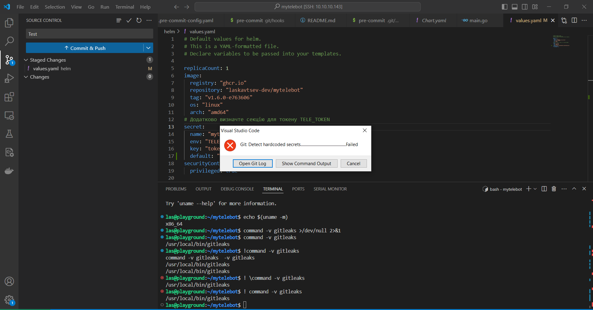

1. Встановлюємо pre-commit:
```bash
$ sudo apt-get install pre-commit

$ pre-commit --version
pre-commit 2.17.0

$ touch .pre-commit-config.yaml

$ nano .pre-commit-config.yaml
```
```yaml
repos:
  - repo: https://github.com/gitleaks/gitleaks
    rev: v8.16.1
    hooks:
      - id: gitleaks
```
```bash
$ pre-commit install
pre-commit installed at .git/hooks/pre-commit
```
2. Встановлюємо gitleaks:
```bash
$ cd ..
$ git clone https://github.com/gitleaks/gitleaks.git
$ cd gitleaks
$ make build
$ cp gitleaks /usr/local/bin
$ gitleaks detect --source . --log-opts="--all"
```

4. Перевірка роботи: змінимо щось в helm/values
```bash
las@playground:~/mytelebot$ git commit -m "this commit contains a secret"
Detect hardcoded secrets.................................................Failed
- hook id: gitleaks
- exit code: 1

○
    │╲
    │ ○
    ○ ░
    ░    gitleaks

Finding:     default: "REDACTED
Secret:      REDACTED
RuleID:      github-pat
Entropy:     4.953056
File:        helm/values.yaml
Line:        17
Fingerprint: helm/values.yaml:github-pat:17

12:58PM INF 1 commits scanned.
12:58PM INF scan completed in 13.9ms
12:58PM WRN leaks found: 1
```


5. Створимо pre-commit-hook для автоматичного встановлення gitleaks на різних операційних системах:
```bash
$ nano .git/hooks/pre-commit
```
Додаємо наступне:
```code
ENABLE_GITLEAKS=$(git config --bool hooks.gitleaks)
if [ "$ENABLE_GITLEAKS" != "true" ]; then
  echo "Gitleaks hook is disabled. Enable it by running:"
  echo "git config --bool hooks.gitleaks true"
  exit 0
fi

detect_os() {
  if [ "$(uname)" = "Darwin" ]; then
    OS='Darwin'
  elif [ "$(uname)" = "Linux" ]; then
    OS='Linux'
  elif [ "$OS" = "Windows_NT" ]; then
    OS='Windows'
  else
    OS='Unknown'
  fi
}

detect_arch() {
  case "$(uname -m)" in
   'x86_64')
      ARCH='x86_64'
      ;;
    'arm64')
      ARCH='arm64'
      ;;
    *)
      ARCH='Unknown'
      ;;
  esac
}

install_gitleaks() {
  detect_os
  detect_arch

  if [ "$OS" = "Unknown" ]; then
    echo "Unsupported OS: $OS"
    exit 1
  fi

  if [ "$OS" = "Windows" ]; then
    ARCH='x86_64'
  fi

  if [ "$ARCH" = "Unknown" ]; then
    echo "Unsupported architecture: $ARCH"
    exit 1
  fi

  case "$OS" in
    'Linux')
      if [ "$ARCH" = "x86_64" ]; then
        URL="https://github.com/gitleaks/gitleaks/releases/latest/download/gitleaks-linux-amd64"
      elif [ "$ARCH" = "arm64" ]; then
        URL="https://github.com/gitleaks/gitleaks/releases/latest/download/gitleaks-linux-arm64"
      fi
      ;;
    'Darwin')
      if [ "$ARCH" = "x86_64" ]; then
        URL="https://github.com/gitleaks/gitleaks/releases/latest/download/gitleaks-darwin-amd64"
      elif [ "$ARCH" = "arm64" ]; then
        URL="https://github.com/gitleaks/gitleaks/releases/latest/download/gitleaks-darwin-arm64"
      fi
      ;;
    'Windows')
      URL="https://github.com/gitleaks/gitleaks/releases/latest/download/gitleaks-windows-amd64.exe"
      ;;
  esac

  echo "Downloading gitleaks from $URL..."
  if [ "$OS" = "Windows" ]; then
    curl -sSL $URL -o gitleaks.exe
    mkdir -p "%LOCALAPPDATA%/gitleaks"
    move gitleaks.exe "%LOCALAPPDATA%/gitleaks/gitleaks.exe"
    GITLEAKS_PATH="%LOCALAPPDATA%/gitleaks/gitleaks.exe"
  else
    curl -sSL $URL -o gitleaks
    chmod +x gitleaks
    sudo mv gitleaks /usr/local/bin/gitleaks
    GITLEAKS_PATH="gitleaks"
  fi
}

if ! command -v gitleaks >/dev/null 2>&1 && ! command -v "$LOCALAPPDATA/gitleaks/gitleaks.exe" >/dev/null 2>&1; then
  echo "Gitleaks not found, installing..."
  install_gitleaks
else
  if [ "$OS" = "Windows" ]; then
    GITLEAKS_PATH="$LOCALAPPDATA/gitleaks/gitleaks.exe"
  else
    GITLEAKS_PATH="gitleaks"
  fi
  echo "Gitleaks is already installed"
fi

exit 0
```
Цей скрипт кожний комміт перевіряє:
1) Чи увімкнено gitleaks? Якщо ні - видає пораду:
Gitleaks hook is disabled. Enable it by running:"
git config --bool hooks.gitleaks true
2) Визначає тип операційної системи і її архітектуру, підбираючи відповідне посилання на скачування потрібної версії gitleaks
3) Далі, в залежності від ОС і архітектури, виконує команду завантаження gitleaks з веб-ресурсу, за допомогою curl з попередньо визначенного URL
4) Завантажений бінарник копіюється у місце, звідки він буде глобально-доступним для виконання.
5) Нарешті перевіряємо, чи встановлено gitleaks

